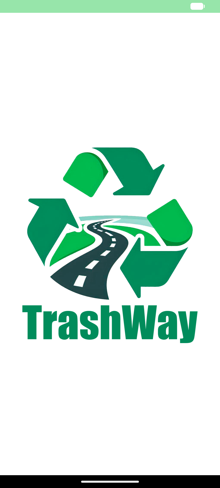
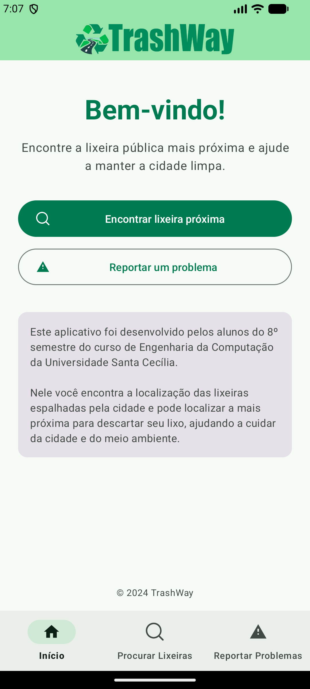
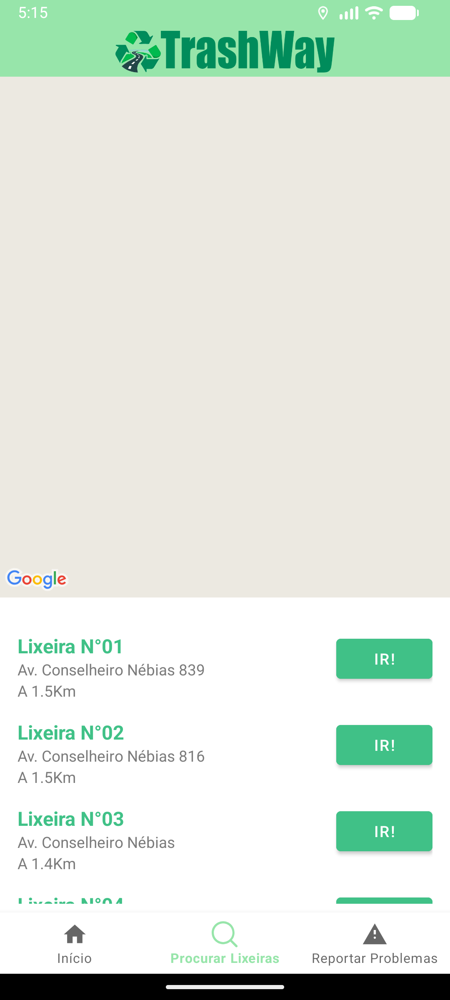
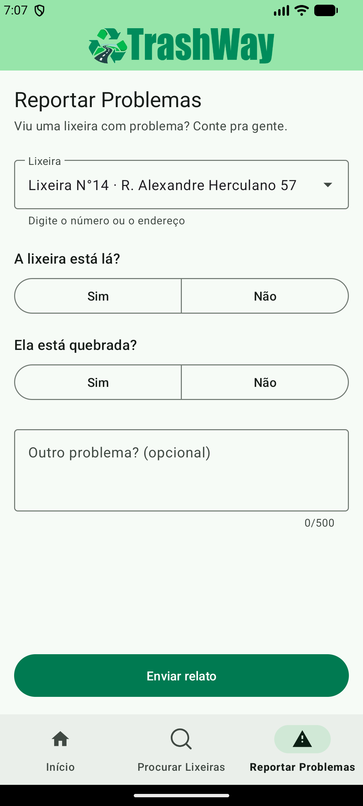

# TrashWay

Aplicativo Android que ajuda a encontrar a **lixeira pública mais próxima** e a **reportar problemas** nas lixeiras da cidade.

Projeto desenvolvido pelos alunos do 8º semestre de Engenharia da Computação da **Universidade Santa Cecília (Santos/SP)**. A base de dados conta com quase 100 lixeiras mapeadas na orla e nos bairros de Santos (Gonzaga, Boqueirão, Av. Conselheiro Nébias etc.).

## Telas

| Abertura | Início | Procurar Lixeiras | Reportar Problemas |
|:---:|:---:|:---:|:---:|
|  |  |  |  |

## Funcionalidades

- **Mapa de lixeiras:** exibe no Google Maps todas as lixeiras cadastradas e a sua posição atual, atualizada em tempo real. Lixeiras próximas umas das outras são agrupadas quando o mapa está afastado.
- **Lixeira mais próxima primeiro:** a lista, num painel que se arrasta sobre o mapa, é ordenada pela distância até você (fórmula de Haversine) e destaca a mais próxima.
- **Lista interativa:** tocar em um item centraliza o mapa na lixeira; tocar em um marcador rola a lista até ela.
- **Ir à mais próxima:** na tela inicial, um toque abre a navegação até a lixeira mais perto de você.
- **Navegação dentro do app:** o botão **Rota** entra num modo de navegação em tela cheia no estilo de jogos de localização: câmera 3D que segue você e gira com a bússola do celular, avatar que desliza pelo mapa, rota a pé desenhada pelas ruas (Routes API) com a próxima manobra e o tempo restante. Ao sair do caminho a rota é recalculada; sem rota disponível, uma seta aponta direto para a lixeira. Ao chegar, o celular vibra e pergunta se a lixeira está ok, com atalho para reportar. O Google Maps continua disponível pelo botão de abrir externamente.
- **Adicionar lixeiras ao mapa:** viu uma lixeira que não aparece no app? Marque o local (a até 50 m de você). Quando 5 pessoas diferentes confirmarem, ela entra no mapa para todos. Administradores cadastram direto.
- **Pedir lixeira (voz do povo):** aponte um lugar onde falta lixeira. Outras pessoas apoiam o pedido de qualquer lugar, e o número de apoios aparece no mapa, mostrando onde a cidade mais precisa de lixeiras. Quando uma for instalada, um administrador a adiciona ao mapa.
- **Login só quando precisa:** sugerir, confirmar e apoiar pedem conta Google (cada pessoa conta uma vez). Mapa, navegação e relatos funcionam sem conta.
- **Reportar problemas:** informe se a lixeira sumiu, se está quebrada ou descreva outro problema. A lixeira pode ser buscada pelo número ou endereço, ou escolhida direto na lista do mapa. O relato é salvo no Firebase.

## Como funciona

```
┌──────────────┐     lixeiras (nome, local, coordenada)     ┌─────────────────────┐
│  TrashWay    │ ◄───────────────────────────────────────── │  Firebase Firestore │
│  (Android)   │ ──────────────────────────────────────────►│                     │
└──────┬───────┘     Problemas (relatos dos usuários)       └─────────────────────┘
       │
       ├── Google Maps SDK ........ mapa e marcadores
       ├── Routes API ............. rota a pé (navegação no app)
       └── Fused Location Provider  localização do usuário
```

- `MainActivity` → tela de abertura (SplashScreen API) e navegação inferior entre as três telas.
- `ui/home` → tela inicial com a apresentação do projeto.
- `ui/Mapa` → `DashboardFragment` (mapa + painel com a lista), `LixeiraViewModel` (leitura do Firestore e cálculo de distâncias), `LixeiraAdapter` e o agrupamento de marcadores (`LixeiraClusterItem`).
- `ui/problemas` → `NotificationsFragment`, formulário que grava na coleção `Problemas` (validado pelas regras em `firestore.rules`).

## Tecnologias

- Kotlin · Android SDK (minSdk 26, targetSdk 34)
- Arquitetura MVVM com ViewModel + LiveData
- ViewBinding e Navigation Component
- Material Design 3 (tema claro e escuro)
- Google Maps SDK for Android, Maps Utils (agrupamento) e Google Play Services Location
- Firebase Firestore e Firebase App Check

## Como executar

### Pré-requisitos
- Android Studio (ou Android SDK + JDK 17/21)
- Um projeto no [Firebase](https://console.firebase.google.com/) com o Firestore ativado
- Uma chave de API do [Google Maps SDK for Android](https://console.cloud.google.com/google/maps-apis)

### Configuração

As chaves **não** ficam no repositório. Antes de compilar:

1. **Chave do Google Maps:** adicione ao arquivo `local.properties`, na raiz do projeto (ele já é ignorado pelo Git):
   ```properties
   MAPS_API_KEY=sua_chave_aqui
   ```
   A mesma chave é usada para calcular as rotas a pé: ative também a **Routes API** no projeto do Google Cloud (se a chave tiver restrição de APIs, inclua a Routes API nela). Para usar outra chave só para as rotas, adicione `ROUTES_API_KEY=...` no mesmo arquivo.
2. **Firebase:** baixe o `google-services.json` do seu projeto Firebase e coloque-o em `app/google-services.json`. O arquivo `app/google-services.json.example` mostra o formato esperado.
3. **Dados:** crie no Firestore a coleção `lixeiras`, com documentos no formato:
   ```json
   { "nome": "Lixeira N°01", "local": "Av. Conselheiro Nébias 839", "coordenada": <GeoPoint> }
   ```

### Rodando
```bash
./gradlew installDebug
```
Ou abra a pasta no Android Studio e clique em **Run**. Conceda a permissão de localização para ver as lixeiras mais próximas.

> **Dica (emulador):** para simular uma posição em Santos, use `adb emu geo fix -46.3336 -23.9608`.
